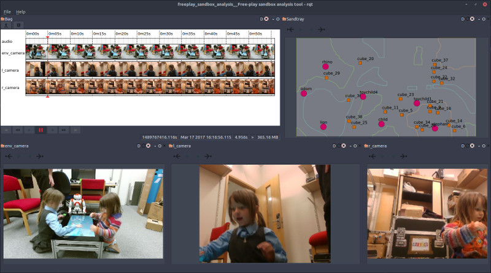

Free-play Sandbox -- Data Analysis
==================================

*This project is part of the 'Free-play Sandbox' experimental framework for
Cognitive Human-Robot Interaction research. [Check the PInSoRo
website](https://freeplay-sandbox.github.io/) for details and
[documentation](https://freeplay-sandbox.github.io/freeplay-software)*.



A [rqt](http://wiki.ros.org/rqt) GUI to visualise and analyse the 'freeplay
sandbox' recordings.

The interface is heavily based on
[rqt_bag](https://github.com/ros-visualization/rqt_common_plugins/tree/master/rqt_bag).

Data replay
-----------

### Replaying with rosbag

```
rosbag play <bag file>
```


### Replaying the pose & facial data overlaid on the videos


You need to compile first the `replay_with_poses` utility:

```
mkdir build && cd build
cmake -DCMAKE_BUILD_TYPE=Release ..
make
```

Then:
```
./replay_with_poses --topics camera_purple/rgb/image_raw/compressed camera_yellow/rgb/image_raw/compressed  --path $DATASET/<session>/
```

`replay_with_poses` has many options (to display or not raw video stream,
skeletons, gaze estimate, etc.). Check `replay_with_poses --help`.


Using the `--video <output.mkv>` option, you can export the resulting video. The
script [`generate_videos`](scripts/generate_videos) shows how to use this
feature to extract the video streams for the whole dataset.

### Gaze estimation


Gaze estimation requires the [Caffe machine learning
framework](http://caffe.berkeleyvision.org/) which is packaged in recent
versions of Ubuntu -- `apt install caffe-cuda`.

Once Caffe is installed, reconfigure and recompile `replay_with_pose`.
`replay_with_poses --help` should now have options to enable gaze estimation:


Dataset processing
------------------

### Skeleton & facial feature extraction

We rely on [CMU
OpenPose](https://github.com/CMU-Perceptual-Computing-Lab/openpose) to extract
2D skeleton & facial features. **You must first install OpenPose** (which itself
requires a working Caffe installation).

Once OpenPose is installed, you can enable the CMake option `WITH_OPENPOSE`
(`cmake -DWITH_OPENPOSE=ON ..`) and recompile.

This generates a new tool calls `extract_poses` that takes a bag file as
parameter, extract all the skeleton, facial features and hands from the video
streams, and store them as a JSON file. Type `extract_poses --help` for details.

### Format of poses files

The extracted pose files (typically, `freeplay.poses.json`) have the following
structure (see also [figures on the OpenPose
website](https://github.com/CMU-Perceptual-Computing-Lab/openpose/blob/master/doc/output.md#pose-output-format)):

```
 {<topic_name>:
    {"frames" : [{
        "ts": <timestamp in floating sec>,
        "poses": {
            "1": [ # pose index
                # x,y in image coordinate, c is confidence in [0.0,1.0]
                [x, y, c], # 0- Nose
                [x, y, c], # 1- Neck
                [x, y, c], # 2- RShoulder
                [x, y, c], # 3- RElbow
                [x, y, c], # 4- RWrist
                [x, y, c], # 5- LShoulder
                [x, y, c], # 6- LElbow
                [x, y, c], # 7- LWrist
                [x, y, c], # 8- RHip
                [x, y, c], # 9- RKnee
                [x, y, c], # 10- RAnkle
                [x, y, c], # 11- LHip
                [x, y, c], # 12- LKnee
                [x, y, c], # 13- LAnkle
                [x, y, c], # 14- REye
                [x, y, c], # 15- LEye
                [x, y, c], # 16- REar
                [x, y, c]  # 17- LEar
            ],
            "2": [ # if present, second skeleton
              ...
            ]
      },
      "faces": {
            "1": [ # face index
              # x,y in image coordinate, c is confidence in [0.0,1.0]
              [x, y, c],
              ... # 70 points in total, see OpenPose website for indices
            ],
            "2": [
               ...
            ]
      }
      "hands": {
            "1": { # hand index
                "left": [
                    # x,y in image coordinate, c is confidence in [0.0,1.0]
                    [x, y, c],
                    ... # 20 points in total, see OpenPose website for indices
                ],
                "right": [
                    # x,y in image coordinate, c is confidence in [0.0,1.0]
                    [x, y, c],
                    ... # 20 points in total
                ]
            },
            "2":
              ...
        }
    },
    { # 2nd frame
        "ts": ...
        "poses":
        ...
    }
    ]
  }
}
```

Because these JSON files are typically large (>100MB for 20-25 min), we
recommend you carefully choose your [JSON
library](https://github.com/miloyip/nativejson-benchmark) both in terms of
parsing speed and memory requirements (hint: `libjsoncpp` does not do great).

In our experience, [nlohmann JSON library](https://nlohmann.github.io/json/)
does a decent job.


Other processings
-----------------


### Convert a bag video stream to a regular video

You can extract a video stream from one of the bag file and save it as a video.

First, install the `bag_tools`:
```sh
sudo apt install ros-kinetic-bag-tools
```

Then:

```sh
rosrun bag_tools make_video.py <topic> <bag> --output <output.mp4> --fps <fps>
```

For instance:
```sh
rosrun bag_tools make_video.py env_camera/qhd/image_color/compressed freeplay.bag --output freeplay_env.mp4 --fps 28.0
```

(note that, due to an upstream bug, one needs first to replace the type of the `fps`
parameter from `int` to `float` in `make_video.py` for non-integer FPS to work)

**Alternatively, you can use `replay_with_pose` to replay the videos (including
overlaying skeleton/face features if desired) and save them as video files. [See
above for details](#replaying-the-pose--facial-data-overlaid-on-the-videos).**

### Convert a bag audio stream to a regular audio file

To extract audio and save it as an audio file:

```sh
rosrun audio_play audio_play audio:=<topic> _dst:=<file.ogg>
```

For instance:
```sh
rosrun audio_play audio_play audio:=camera_purple/audio _dst:=freeplay_purple.ogg &
rosbag play freeplay.bag
```

### Generate a video mosaic of the whole dataset

Once the video streams have been extracted from the bag files (cf above), you
can use the script [`create_video_mosaic`](scripts/create_video_mosaic) to
generate a mosaic with 49 streams tiled together. This requires `ffmpeg`.
